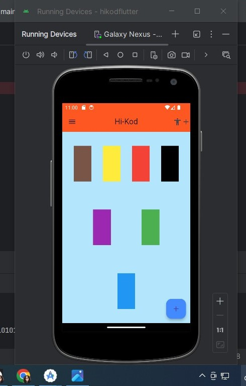

# Hi-Kod Uygulaması

## Proje Açıklaması
Hi-Kod, kullanıcıların çeşitli renklerde sütunlar oluşturabileceği bir mobil uygulamadır. Uygulama, kullanıcıların kolaylıkla renkli sütunlar eklemelerini ve düzenlemelerini sağlar.

## Tasarım Detayları
- **Başlık**: Uygulamanın üst kısmında "Hi-Kod" başlığı yer almaktadır.
- **4 Sütun**: Ekranın üst kısmında, yan yana 4 sütun bulunmaktadır.
- **2 Sütun**: Üst sütunların altında, ortada yan yana 2 sütun yer almaktadır.
- **1 Sütun**: En altta tek bir sütun bulunmaktadır.
- **+ Butonu**: Uygulamanın sağ alt köşesinde yeni sayfa eklemek için bir + butonu bulunmaktadır.

### Ekran Görüntüsü
Aşağıda uygulamanın ana ekran görüntüsü bulunmaktadır:

## Kullanım
Bu proje, Row ve Column hizalama widget'larını kullanarak basit bir arayüz oluşturmak için tasarlanmıştır. Kullanıcılar uygulamayı indirip çalıştırarak tasarımı deneyimleyebilirler.

## Bağlantılar
- [GitHub Repository](https://github.com/bushravision/hi-kodflutter)
